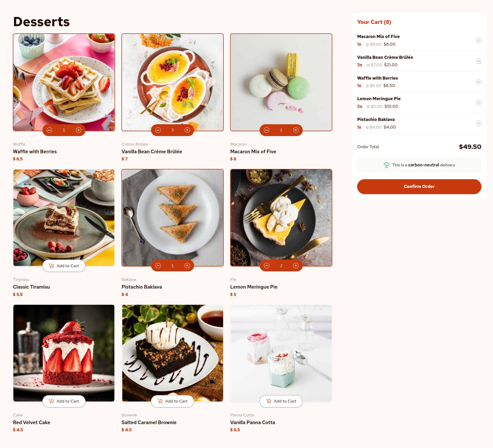
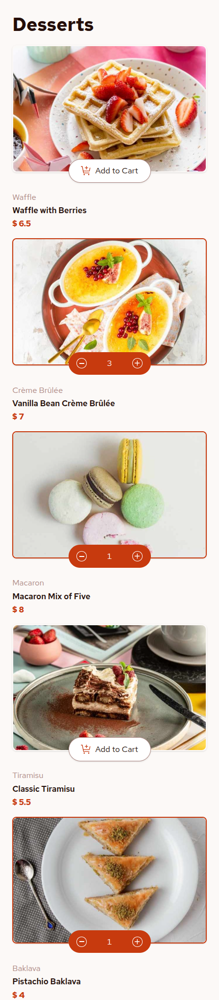
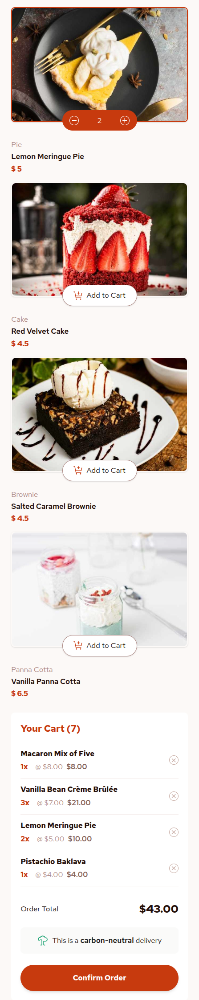

# Frontend Mentor - Product list with cart solution

This is a solution to the [Product list with cart challenge on Frontend Mentor](https://www.frontendmentor.io/challenges/product-list-with-cart-5MmqLVAp_d). Frontend Mentor challenges help you improve your coding skills by building realistic projects.

## Table of contents

- [Overview](#overview)
    - [The challenge](#the-challenge)
    - [Screenshot](#screenshot)
    - [Links](#links)
- [My process](#my-process)
    - [Built with](#built-with)
    - [Continued development](#continued-development)
    - [Useful resources](#useful-resources)
- [Author](#author)

## Overview

### The challenge

Users should be able to:

- Add items to the cart and remove them
- Increase/decrease the number of items in the cart
- See an order confirmation modal when they click "Confirm Order"
- Reset their selections when they click "Start New Order"
- View the optimal layout for the interface depending on their device's screen size
- See hover and focus states for all interactive elements on the page

### Screenshots

| Desktop View                                     | Mobile View |
|--------------------------------------------------|-------------|
|  |   |

### Links

- Solution URL: [Dessert](https://github.com/thyuhtooaung-dev/Dessert)
- Live Site URL: [Vercel](https://dessert-mocha.vercel.app/)

## My process

### Built with

- Semantic HTML5 markup
- CSS custom properties
- Flexbox
- CSS Grid
- Mobile-first workflow
- [React](https://reactjs.org/) - JS library
- [Tailwindcss](https://tailwindcss.com/)

### Continued Development
This is an ongoing project, and there’s plenty of room for improvement. I’ll continue refining the design, logic, and overall user experience over time.

You’re welcome to contribute freely open an issue, propose changes, or submit a pull request if you’d like to help improve the project.

### Useful Resources

- [Framer Motion Documentation](https://www.framer.com/motion/) – This was my first time working with Framer Motion, and the official documentation made it much easier to grasp animations, layout transitions, and component motion.

## Author

- Github - [Thyu Htoo Aung](https://github.com/thyuhtooaung-dev)
- Frontend Mentor - [@PoungMont](https://www.frontendmentor.io/profile/thyuhtooaung-dev)
- X - [@PoungMont](https://x.com/Poung_Mont)