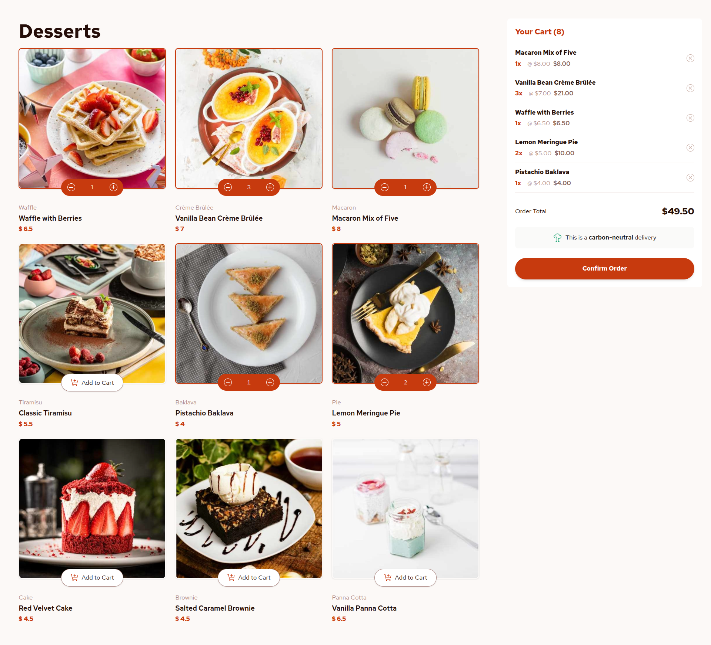
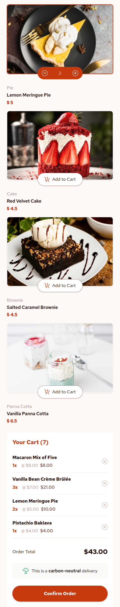

# Desserts

A full-stack asynchronous ordering platform featuring real-time cart synchronization, complex state management, and a persistent headless backend. This project demonstrates advanced UI interaction patterns, modal orchestration, and seamless data flow between a React frontend and a NestJS/Supabase infrastructure.

[Live Site URL](https://desserts-topaz.vercel.app/) | [Source Code](https://github.com/thyuhtooaung-dev/Dessert)

## System Architecture

### Frontend

* **React & Tailwind CSS**: Implements a mobile-first, utility-driven UI with a focus on high-fidelity interactive elements and fluid layout transitions.
* **Framer Motion**: Orchestrates complex layout animations, specifically for cart entry/exit transitions and the order confirmation modal reveals.
* **State Management**: Centralized logic for handling multi-item cart operations, including incremental quantity adjustments and global total calculations.

### Backend

* **NestJS**: A modular architecture serving as the API layer to manage product catalogs and validate order structures.
* **Supabase (PostgreSQL)**: Leveraging Row Level Security (RLS) and a relational schema to ensure high-performance data retrieval for the product suite.

---

## Core Engineering Features

### Advanced Cart Orchestration

* **Granular Quantity Control**: A specialized UI component logic that toggles between "Add to Cart" and an active increment/decrement state, ensuring a frictionless UX.
* **Real-Time Validation**: Instantaneous calculation of order totals and per-item pricing using a centralized state derived from the primary product data.
* **State Persistence**: Engineered to maintain selection integrity across different viewports and interaction states.

### Dynamic Order Lifecycle

* **Confirmation Modal Workflow**: A multi-step transition from cart review to a finalized "Order Confirmed" state, featuring a summary of purchased items and total expenditure.
* **Session Reset Logic**: Integrated "Start New Order" functionality that performs a clean sweep of the application state and UI transitions without requiring a page reload.

### Responsive Design & Interaction

* **Adaptive Grid Layouts**: Utilizes CSS Grid to transition from a single-column mobile view to a dense multi-column desktop catalog while maintaining visual hierarchy.
* **Interactive State Feedback**: Custom-built hover and focus states for all interactive primitives, ensuring the platform meets modern accessibility and usability standards.

---

## Performance Previews
| Desktop View | Mobile View |
| :--- | :--- |
|  |  |

---

## Author

**Thyu Htoo Aung** [GitHub](https://github.com/thyuhtooaung-dev) | [Frontend Mentor](https://www.frontendmentor.io/profile/thyuhtooaung-dev) | [X / Twitter](https://x.com/Poung_Mont)

---
